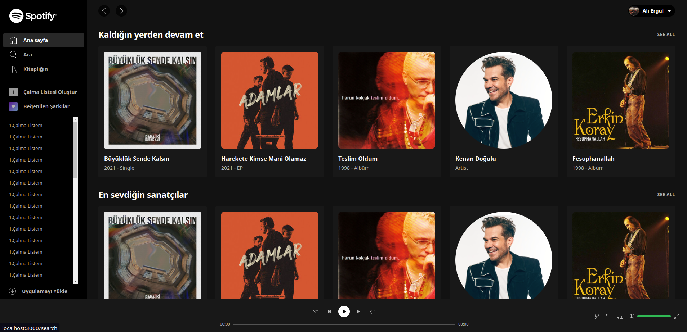
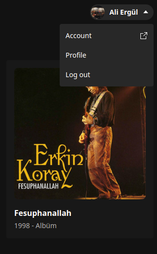
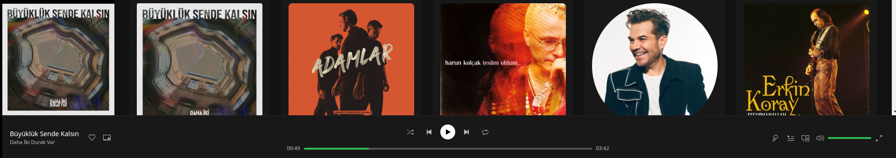
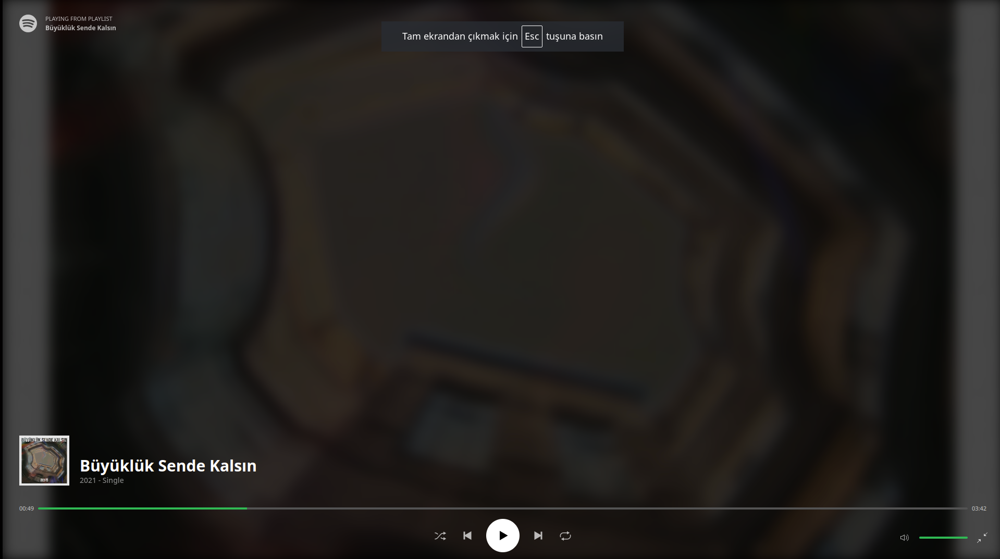
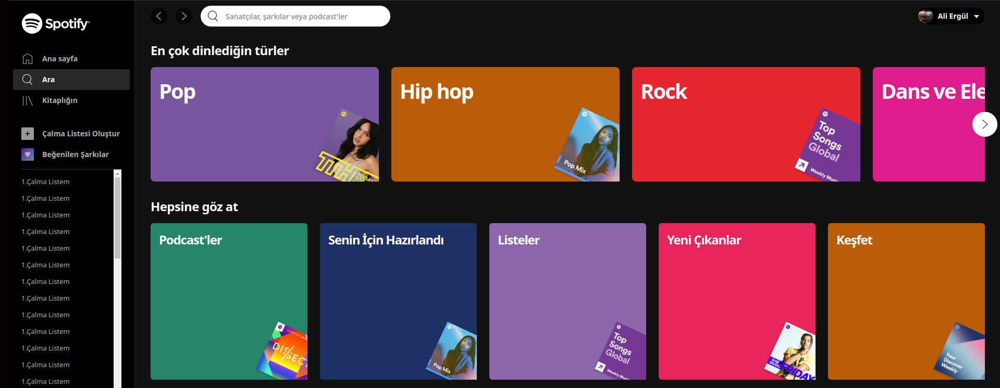
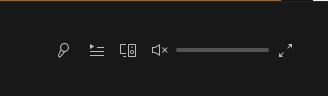

# Bu projede React.js ve TailwindCSS kullanılarak Spotify web sayfası klonlanmıştır.

Proje geliştirilirken aşağıdaki paketler kullanılmıştır:
* Redux Toolkit
* TailwindCSS
* react-indiana-drag-scroll
* react-range
* react-router-dom (v5)
* react-use

Projede örnek olarak kullanılan şarkıların ve sanatçıların bilgileri local'de oluşturulup kullanılmıştır. Projede Spotify ana sayfası taklit edilmiş, eklenen şarkıların çalması sağlanmış, Spotify'da olduğu gibi şarkıyı tam ekran yapma özelliği eklenmiş ve arama sayfası da taklit edilmiştir. İLerleyen zamanlarda Kitaplığın sayfası eklenebilir, çalma listesi oluşturma, şarkıları kuyruğa alma gibi işlemler eklenebilir.

